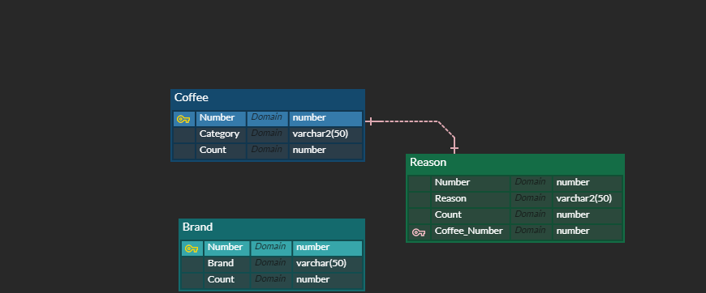

# 32. 설문조사 어플리케이션 만들기2

Created: May 11, 2022
Created by: Jieun Kim

# 구현을 위한 설계

## 주제 : 카페 선호도 조사

## 요구사항

- 어떤 결과가 구현되어야 하는가??
  ⇒ 카페 형태별 선호도, 프랜차이즈 Brand별 선호도, 선택 이유, 선택 비율 확인

## 데이터베이스 모델링

## 콘솔 출력 포멧 설계(UI)

- Main
  설문조사 - 좋아하는 영화 장르는?
  1. 설문에 참여
  2. 설문 현황 보기
  3. 프로그램 종료

#1. 설문 참여

1. 프랜차이즈 vs 일반 카페 중 선호하는 형태는?

   1. 프랜차이즈
   2. 일반 카페

   → 1. 프랜차이즈 선택시 : 선호하는 곳을 골라주세요

   1. 스타벅스
   2. 투썸플레이스
   3. 이디야
   4. 메가커피
   5. 기타 (직접 입력)

1. 선택한 이유는?
   1. 가격
   2. 접근성
   3. 서비스
   4. 맛
   5. 기타 (분위기 등)

#2. 설문 현황 보기

1. Table1 ⇒ 프랜차이즈 vs 일반 카페 투표
1. Table2 ⇒ 프랜차이즈 세부
1. Table3 ⇒ Table 1 & 2 선택한 이유 : 퍼센트(비율)

## 기능 설계

- 데이터베이스 - DB Table 정의

  create table "COFFEE" (
  "NUMBER" number primary key,
  "CATEGORY" varchar2(50) not null,
  "COUNT" number
  );

  create table "BRAND" (
  "NUMBER" number primary key,
  "BRAND" varchar2(50) not null,
  "COUNT" number
  );

  -create sequence "SEQ_BRAND" NOCACHE;

  create table "REASON" (
  "NUMBER" number primary key,
  "REASON" varchar2(50) not null,
  "COUNT" number,
  "COFFEE_NUMBER" number
  );

  alter table "REASON" add constraint "FK_COFFEE_NUMBER" foreign key("COFFEE_NUMBER") references "COFFEE"("NUMBER") on delete cascade;

- 자바 클래스 정의
  - jcbcTemplate
  - DB 연동
    ⇒ CoffeeVO / CoffeeDAO
    - updateC(int Number)
      update “COFFEE” set “COUNT”=count+1 where “NUMBER”=?
    - List<CoffeeVO> selectAll( )
      select “NUMBER”,”CATEGORY”,”COUNT” from “COFFEE” order by “NUMBER”
      ⇒ BrandVO / BrandDAO
    - insertBrand(String name)
    - updateCount(int number)
    - checkBrand(int number)
    - List<BrandVO> selectAll( )
      ⇒ ReasonVO / ReasonDAO
    - updateReason(int number, int coffee_number)
    - checkReason(int number)
    - List<ReasonVO> selectAll( )
    - Map<String,String> showPer(int coffee_number)
  - Main
  ***

> 버전관리

### Version1 - 2022/05/10

Case1 기능 구현

- Data insert to table1,2,3
- View result from table 1,2,3 (select all)

### Version2 - 2022/05/11

- View result from table 3 (select - ratio_to_report)
