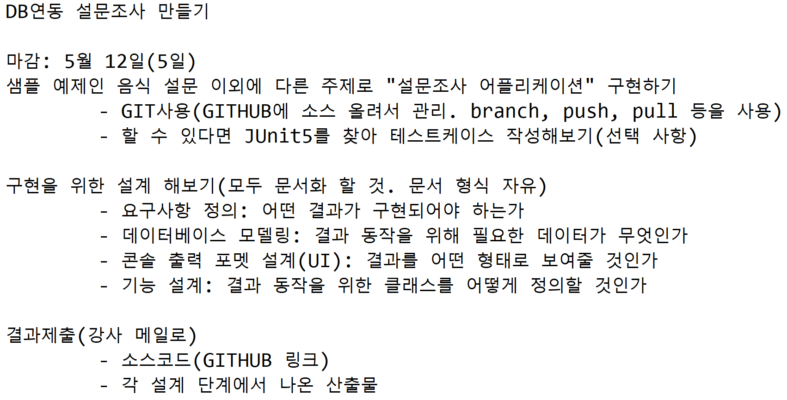

# 32. 설문조사 어플리케이션 만들기

Created: May 6, 2022
Created by: Anonymous
수업 일자: May 6, 2022

# 구현을 위한 설계

## 주제선정

- 좋아하는 영화 장르 (액션, 로맨스, 코미디, 공포/호러, 어린이 등)
-

## 요구사항

- 어떤 결과가 구현되어야 하는가??
  1. 기본 : Main ~ **주제 + 메뉴** 선택지 (1. 설문 참여하기 2. 설문 현황 보기)
  2. Main 화면 → 메뉴 숫자로 **선택**
  3. counting - DB 연동
  4. 기본 화면 (Main)으로 돌아가기 (반복)
  5. - 기타 - 사용자 입력값 받아서 메뉴에 추가 + counting

## 데이터베이스 모델링

- 결과 동작을 위해 필요한 데이터가 무엇인가?
  1. 메뉴 n개 (개수: 입력에 따라 늘어남)
     - 메뉴 번호(Sequence) / 이름 (varchar2) / Count (Int)
  2. 각 메뉴의 지정 번호를 입력받을 때마다 해당 메뉴의 count⇒+1하는 기능
  3. 기타 0 입력시 ⇒ 사용자 입력값을 받아 새로운 행으로 추가(이름 저장) 하면서 count
  4. 설문 현황 메뉴 선택시 현재까지 DB에 저장된 내역 보여줌 - toString 오버라이드+반환

## 콘솔 출력 포멧 설계(UI)

결과를 어떤 형태로 보여줄것인지? - 기본 구성

- Main
  설문조사 - 좋아하는 영화 장르는?
  1. 설문에 참여
  2. 설문 현황 보기
     선택 (1 or 2 입력) :
- 1. 설문 참여
  1. 공포
  1. 액션
  1. 로맨스
  1. 코미디

  1. 기타(입력)
     선택 (0~n 숫자 입력) :
     설문 완료 //선택 값 입력하고 난 후

- 2. 설문 현황 보기
  1. 공포 ⇒ 값
  1. 액션 ⇒ 값
  1. 로맨스 ⇒ 값
  1. 코미디 ⇒ 값

  1. 기타(입력) ⇒ 값

## 기능 설계

결과 동작을 위한 클래스를 어떻게 정의할 것인가

- 데이터베이스 - 테이블 Survey : 사용자 입력시 각 row 의 counting 값을 +1 하여 저장
    <aside>
    💡 auto_increment?? sequence? 찾아보기 X
    카운트 ⇒ 각 카테고리의 **칼럼값만 +1** 되게 update하는 쿼리? (row 변경 x)
    or 입력할때마다 동일 name의 row가 추가되면서, 값은 count 쿼리로  sum값 보여줌 X
    
    </aside>

- 자바 클래스 정의

  - jcbcTemplate
  - 오라클과 연동될 부분
    ⇒ SurveyVO : int number, String name, sequence; getter/setter, toString Override
    ⇒ SurveyDAO :
    - insertCat(string Name) ⇒ boolean 반환 ~~> **1 —> 0. 기타(입력)**
      query : insert into “SURVEY” values (?,?,?)
    - updateCat(int Number) : ~~> **1 —> 1~n. 선택**
      query : update “SURVEY” set “COUNT”=count+1 where “NUMBER”=?
    - List<ScoreVO> selectAll( ) { } ~~> **기본**메뉴에서 **2** 선택
  - surveyPro: SurveyDAO 활용한 Program setting
    SurveyDAO 객체 참조

    1. 기본 화면 반환 (1 or 2)

       1-1 ⇒ 1 or 2외의 다른 값 (숫자 / 스트링 등) 입력시 break; + 입력값이 잘못되었습니다

    2. DB와 연동된 surveyDAO 로, 입력 정수 값에 따른 query 연동 (1 ⇒ 0 : insert, 1~n : update / 2 ⇒ select)

       2-1 ⇒ 0~n 외의 다른 값 입력시 break; + 입력값이 잘못되었습니다.

  - Main : 실제 실행 부분 - surveyPro 객체 참조 (서베이 시작?)

  ***

  create table "SURVEY" (
  2 "NUMBER" number primary key,
  3 "NAME" varchar2(50) not null,
  4 "COUNT" number
  5 );
